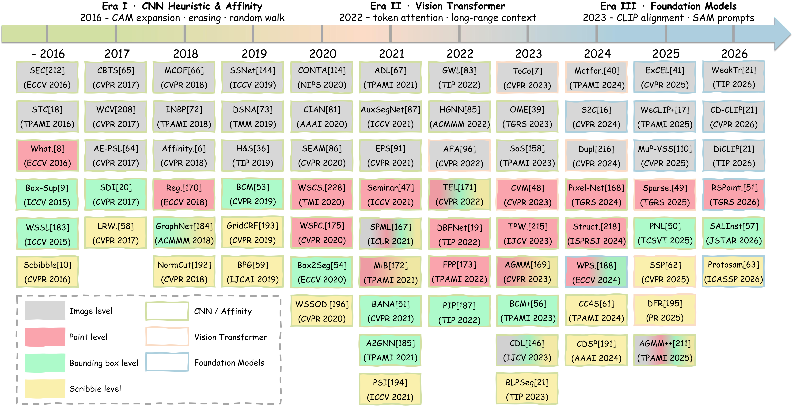
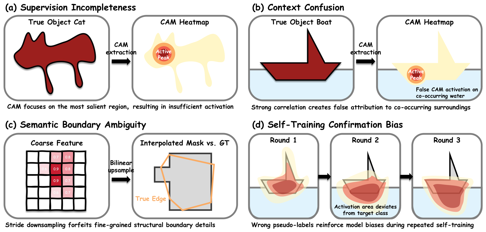
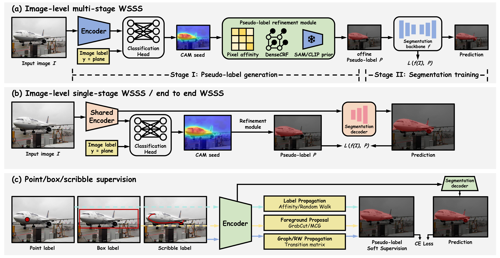

[](https://github.com/sindresorhus/awesome)
[](../../pulls)
<br />
<p align="center">
  <h1 align="center">A Unified Survey of Weakly Supervised Semantic Segmentation</h1>
  <p align="center">
    <b>Supervision Forms, Methods, and Applications</b>
    <br />
    <b>Submitted to IEEE TPAMI</b>
    <br />
    <strong>Yifan Zhang</strong>
    ·
    <strong>Haoying Zeng</strong>
    ·
    <strong>Zhiguo Jiang</strong>
    ·
    <strong>Gemine Vivone</strong>
    ·
    <strong>Haopeng Zhang</strong>
  </p>
  <p align="center">
    <a href='./'></a>
    <a href='./'></a>
  </p>
</p>

<p align="center">  </p>

**<p align="center"> Roadmap of Representative WSSS Methods (2016–2026) </p>**

<p align="center">  </p>

**<p align="center"> Fundamental Dilemmas in WSSS </p>**

This repository tracks and benchmarks weakly supervised semantic segmentation (WSSS) methods to supplement our survey:

> **A Unified Survey of Weakly Supervised Semantic Segmentation: Supervision Forms, Methods, and Applications**
>
> Yifan Zhang, Haoying Zeng, Zhiguo Jiang, Gemine Vivone, Haopeng Zhang
>
> *Submitted to IEEE Transactions on Pattern Analysis and Machine Intelligence (TPAMI).*

**Please leave a <font color='orange'>STAR ⭐</font> if you find this project useful!**

### 🔥 Highlight!!

- A **unified taxonomy** of WSSS by supervision form: image-level, point, bounding box, and scribble.
- Covers the full evolution from **CAM / affinity** heuristics, through **Vision Transformers**, to **foundation-model** priors (CLIP, DINO, SAM).
- Summarizes **natural-image benchmarks** (PASCAL VOC, MS COCO) and **cross-domain** settings (remote sensing, medical, driving, 3D, video).
- Provides **fair comparisons** on mIoU and computational footprint, plus open directions for deployment.
- This repo lists papers appearing in our survey with year, venue, title/link, and code when available.

# Introduction

Semantic segmentation usually requires expensive pixel-level masks. **Weakly supervised semantic segmentation (WSSS)** learns dense predictions from cheaper labels such as image tags, points, boxes, or scribbles.

Over the past decade, WSSS has moved from heuristic CAM expansion and affinity propagation, to Transformer token modeling, and now to foundation-model-empowered pipelines. This survey:

1. Formulates a **unified mathematical view** of the four weak-label forms and multi-stage vs. single-stage training.
2. Builds a **method taxonomy** primarily for 2D natural images, with extensions to instance, 3D, and video.
3. Curates **datasets / metrics** and reports quantitative & qualitative comparisons.
4. Reviews **applications** in driving, remote sensing, medicine, and human parsing, and outlines future prospects.

<p align="center">  </p>

**<p align="center"> Survey Paper Structure </p>**

<p align="center">  </p>

**<p align="center"> Training Setups in WSSS (Orthogonal to Label Forms) </p>**

## Citation

If you find our survey helpful, please consider citing (status: **submitted to IEEE TPAMI**):

```bibtex
@article{zhang2026wssssurvey,
  title   = {A Unified Survey of Weakly Supervised Semantic Segmentation: Supervision Forms, Methods, and Applications},
  author  = {Zhang, Yifan and Zeng, Haoying and Jiang, Zhiguo and Vivone, Gemine and Zhang, Haopeng},
  year    = {2026}
}
```

The following tables list papers discussed in the survey. **Code links are filled when known; otherwise left as N/A**.

# Summary of Contents

This content follows the methodology and application taxonomy of our survey.

- [Introduction](#introduction)
  - [Citation](#citation)
- [Summary of Contents](#summary-of-contents)
- [1. Image-Level Supervised Methods](#1-image-level-supervised-methods)
- [2. Point-Supervised Methods](#2-point-supervised-methods)
- [3. Bounding-Box-Supervised Methods](#3-bounding-box-supervised-methods)
- [4. Scribble-Supervised Methods](#4-scribble-supervised-methods)
- [5. Cross-Cutting Themes and Extensions](#5-cross-cutting-themes-and-extensions)
  - [5.1 Weakly Supervised Instance Segmentation](#51-weakly-supervised-instance-segmentation)
  - [5.2 3D Point Clouds (Cross-Cutting)](#52-3d-point-clouds-cross-cutting)
  - [5.3 Video](#53-video)
- [6. Applications](#6-applications)
  - [6.1 Autonomous Driving](#61-autonomous-driving)
  - [6.2 Remote Sensing and Earth Observation](#62-remote-sensing-and-earth-observation)
  - [6.3 Medical Image Analysis](#63-medical-image-analysis)
  - [6.4 Human Parsing and Pedestrian Segmentation](#64-human-parsing-and-pedestrian-segmentation)
- [7. Datasets](#7-datasets)


# 1. Image-Level Supervised Methods

Image-level labels only indicate class presence. Methods invent spatial supervision via CAM expansion, affinity propagation, Transformer tokens, prototypes, background decoupling, foundation-model priors, and single-stage training.

| Year | Venue | Name | Paper Title / Link | Code |
| ---- | ----- | ---- | ------------------ | ---- |
| 2014 | TMM | N/A | [**Representative Discovery of Structure Cues for Weakly-Supervised Image Segmentation**](https://doi.org/10.1109/TMM.2013.2293424) | N/A |
| 2017 | CVPR | AE-PSL | [**Object region mining with adversarial erasing: A simple classification to semantic segmentation approach**](https://ieeexplore.ieee.org/document/8100170) | N/A |
| 2017 | CVPR | N/A | [**Combining bottom-up, top-down, and smoothness cues for weakly supervised image segmentation**](https://ieeexplore.ieee.org/document/8100253) | N/A |
| 2017 | TPAMI | STC | [**STC: A Simple to Complex Framework for Weakly-Supervised Semantic Segmentation**](https://doi.org/10.1109/TPAMI.2016.2636150) | N/A |
| 2018 | CVPR | AffinityNet | [**Learning Pixel-Level Semantic Affinity With Image-Level Supervision for Weakly Supervised Semantic Segmentation**](https://doi.org/10.1109/CVPR.2018.00523) | N/A |
| 2018 | CVPR | DSRG | [**Weakly-Supervised Semantic Segmentation Network With Deep Seeded Region Growing**](https://doi.org/10.1109/CVPR.2018.00733) | [Code](https://github.com/speedinghzl/DSRG) |
| 2018 | CVPR | MCOF | [**Weakly-Supervised Semantic Segmentation by Iteratively Mining Common Object Features**](https://wangxiang10.github.io/papers/CVPR18_XiangWang.pdf) | [Code](https://wangxiang10.github.io/) |
| 2018 | TPAMI | N/A | [**Incorporating Network Built-in Priors in Weakly-Supervised Semantic Segmentation**](https://doi.org/10.1109/TPAMI.2017.2713785) | N/A |
| 2019 | TMM | DSNA | [**Decoupled Spatial Neural Attention for Weakly Supervised Semantic Segmentation**](https://doi.org/10.1109/TMM.2019.2914870) | N/A |
| 2019 | ICCV | SSNet | [**Joint Learning of Saliency Detection and Weakly Supervised Semantic Segmentation**](https://doi.org/10.1109/ICCV.2019.00732) | [Code](https://github.com/zengxianyu/jsws) |
| 2019 | TIP | Tag2Mask | [**Learning to Exploit the Prior Network Knowledge for Weakly Supervised Semantic Segmentation**](https://doi.org/10.1109/TIP.2019.2901393) | N/A |
| 2020 | AAAI | CIAN | [**CIAN: Cross-Image Affinity Net for Weakly Supervised Semantic Segmentation**](https://doi.org/10.1609/aaai.v34i07.6705) | [Code](https://github.com/js-fan/CIAN) |
| 2020 | NeurIPS | CONTA | [**Causal Intervention for Weakly-Supervised Semantic Segmentation**](https://doi.org/10.48550/arXiv.2009.12547) | N/A |
| 2020 | TCSVT | N/A | [**Weakly Supervised Semantic Segmentation by a Class-Level Multiple Group Cosegmentation and Foreground Fusion Strategy**](https://doi.org/10.1109/TCSVT.2019.2962073) | N/A |
| 2020 | CVPR | SC-CAM | [**Weakly-Supervised Semantic Segmentation via Sub-Category Exploration**](https://doi.org/10.1109/CVPR42600.2020.00901) | [Code](https://github.com/Juliachang/SC-CAM) |
| 2020 | CVPR | SEAM | [**Self-Supervised Equivariant Attention Mechanism for Weakly Supervised Semantic Segmentation**](https://doi.org/10.1109/CVPR42600.2020.01229) | [Code](https://github.com/YudeWang/SEAM) |
| 2021 | TPAMI | ADL | [**Attention-Based Dropout Layer for Weakly Supervised Single Object Localization and Semantic Segmentation**](https://doi.org/10.1109/TPAMI.2020.2999099) | [Code](https://github.com/junsukchoe/ADL) |
| 2021 | ICCV | AuxSegNet | [**Leveraging Auxiliary Tasks with Affinity Learning for Weakly Supervised Semantic Segmentation**](https://doi.org/10.1109/ICCV48922.2021.00690) | [Code](https://github.com/xulianuwa/AuxSegNet) |
| 2021 | ICCV | CDA | [**Context Decoupling Augmentation for Weakly Supervised Semantic Segmentation**](https://doi.org/10.1109/ICCV48922.2021.00692) | [Code](https://github.com/suyukun666/CDA) |
| 2021 | ICCV | CGNet | [**Unlocking the Potential of Ordinary Classifier: Class-Specific Adversarial Erasing Framework for Weakly Supervised Semantic Segmentation**](https://doi.org/10.1109/ICCV48922.2021.00691) | [Code](https://github.com/KAIST-vilab/OC-CSE) |
| 2021 | ICCV | CPN | [**Complementary Patch for Weakly Supervised Semantic Segmentation**](https://doi.org/10.1109/ICCV48922.2021.00715) | N/A |
| 2021 | ICCV | ECS-Net | [**ECS-Net: Improving Weakly Supervised Semantic Segmentation by Using Connections Between Class Activation Maps**](https://doi.org/10.1109/ICCV48922.2021.00719) | N/A |
| 2021 | CVPR | EDAM | [**Embedded Discriminative Attention Mechanism for Weakly Supervised Semantic Segmentation**](https://doi.org/10.1109/CVPR46437.2021.01649) | N/A |
| 2021 | CVPR | EPS | [**Railroad Is Not a Train: Saliency as Pseudo-Pixel Supervision for Weakly Supervised Semantic Segmentation**](https://doi.org/10.1109/CVPR46437.2021.00545) | [Code](https://github.com/halbielee/EPS) |
| 2021 | AAAI | Group-WSSS | [**Group-Wise Semantic Mining for Weakly Supervised Semantic Segmentation**](https://doi.org/10.1609/aaai.v35i3.16294) | [Code](https://github.com/Lixy1997/Group-WSSS) |
| 2021 | JSTARS | N/A | [**On the Effectiveness of Weakly Supervised Semantic Segmentation for Building Extraction From High-Resolution Remote Sensing Imagery**](https://doi.org/10.1109/JSTARS.2021.3063788) | N/A |
| 2021 | CVPR | NSROM | [**Non-Salient Region Object Mining for Weakly Supervised Semantic Segmentation**](https://doi.org/10.1109/CVPR46437.2021.00265) | [Code](https://github.com/NUST-Machine-Intelligence-Laboratory/nsrom) |
| 2021 | TMM | SAL | [**SAL: Selection and Attention Losses for Weakly Supervised Semantic Segmentation**](https://doi.org/10.1109/TMM.2020.2991592) | [Code](https://github.com/zmbhou/SALTMM) |
| 2022 | CVPR | AFA | [**Learning Affinity From Attention: End-to-End Weakly-Supervised Semantic Segmentation With Transformers**](https://doi.org/10.1109/CVPR52688.2022.01634) | [Code](https://github.com/rulixiang/afa) |
| 2022 | AAAI | AMR | [**Activation Modulation and Recalibration Scheme for Weakly Supervised Semantic Segmentation**](https://doi.org/10.1609/aaai.v36i2.20108) | [Code](https://github.com/jieqin-ai/AMR) |
| 2022 | ACM MM | BDM + GOP | [**Boat in the Sky: Background Decoupling and Object-Aware Pooling for Weakly Supervised Semantic Segmentation**](https://doi.org/10.1145/3503161.3548201) | N/A |
| 2022 | CVPR | C-CAM | [**C-CAM: Causal CAM for Weakly Supervised Semantic Segmentation on Medical Image**](https://doi.org/10.1109/CVPR52688.2022.01138) | N/A |
| 2022 | CVPR | CLIMS | [**CLIMS: Cross Language Image Matching for Weakly Supervised Semantic Segmentation**](https://doi.org/10.1109/CVPR52688.2022.00444) | [Code](https://github.com/CVI-SZU/CLIMS) |
| 2022 | TIP | Group-WSSS | [**Group-Wise Learning for Weakly Supervised Semantic Segmentation**](https://doi.org/10.1109/TIP.2021.3132834) | [Code](https://github.com/Helens1997/Group-WSSS) |
| 2022 | ACM MM | HGNN | [**Multi-Granular Semantic Mining for Weakly Supervised Semantic Segmentation**](https://doi.org/10.1145/3503161.3547919) | [Code](https://github.com/maeve07/HGNN) |
| 2022 | CVPR | L2G | [**L2G: A Simple Local-to-Global Knowledge Transfer Framework for Weakly Supervised Semantic Segmentation**](https://doi.org/10.1109/CVPR52688.2022.01638) | [Code](https://github.com/PengtaoJiang/L2G) |
| 2022 | CVPR | MCTformer | [**Multi-Class Token Transformer for Weakly Supervised Semantic Segmentation**](https://doi.org/10.1109/CVPR52688.2022.00427) | [Code](https://github.com/xulianuwa/MCTformer) |
| 2022 | PR | N/A | [**Exploiting Shape Cues for Weakly Supervised Semantic Segmentation**](https://doi.org/10.1016/j.patcog.2022.108953) | N/A |
| 2022 | CVPR | N/A | [**Weakly Supervised Semantic Segmentation by Pixel-to-Prototype Contrast**](https://doi.org/10.1109/CVPR52688.2022.00428) | N/A |
| 2022 | JSTARS | N/A | [**Improved Pseudomasks Generation for Weakly Supervised Building Extraction From High-Resolution Remote Sensing Imagery**](https://doi.org/10.1109/JSTARS.2022.3144176) | N/A |
| 2022 | TPAMI | OAA | [**Online Attention Accumulation for Weakly Supervised Semantic Segmentation**](https://doi.org/10.1109/TPAMI.2021.3092573) | N/A |
| 2022 | CVPR | ReCAM | [**Class Re-Activation Maps for Weakly-Supervised Semantic Segmentation**](https://doi.org/10.1109/CVPR52688.2022.00104) | [Code](https://github.com/zhaozhengChen/ReCAM) |
| 2022 | ACM MM | RPIM | [**Region-Based Pixels Integration Mechanism for Weakly Supervised Semantic Segmentation**](https://doi.org/10.1145/3503161.3548141) | N/A |
| 2022 | CVPR | SANCE | [**Towards Noiseless Object Contours for Weakly Supervised Semantic Segmentation**](https://doi.org/10.1109/CVPR52688.2022.01635) | N/A |
| 2022 | CVPR | SIPE | [**Self-Supervised Image-Specific Prototype Exploration for Weakly Supervised Semantic Segmentation**](https://doi.org/10.1109/CVPR52688.2022.00425) | [Code](https://github.com/chenqi1126/SIPE) |
| 2022 | CVPR | W-OoD | [**Weakly Supervised Semantic Segmentation Using Out-of-Distribution Data**](https://doi.org/10.1109/CVPR52688.2022.01639) | [Code](https://github.com/naver-ai/w-ood) |
| 2023 | CVPR | BECO | [**Boundary-Enhanced Co-Training for Weakly Supervised Semantic Segmentation**](https://doi.org/10.1109/CVPR52729.2023.01875) | [Code](https://github.com/ShenghaiRong/BECO) |
| 2023 | IJCV | CDL | [**Credible Dual-Expert Learning for Weakly Supervised Semantic Segmentation**](https://doi.org/10.1007/s11263-023-01796-9) | [Code](https://github.com/zbf1991/CDL) |
| 2023 | CVPR | CLIP-ES | [**CLIP Is Also an Efficient Segmenter: A Text-Driven Approach for Weakly Supervised Semantic Segmentation**](https://doi.org/10.1109/CVPR52729.2023.01469) | [Code](https://github.com/linyq2117/CLIP-ES) |
| 2023 | TPAMI | EPS++ | [**Saliency as Pseudo-Pixel Supervision for Weakly and Semi-Supervised Semantic Segmentation**](https://doi.org/10.1109/TPAMI.2023.3273592) | N/A |
| 2023 | PR | eX-ViT | [**eX-ViT: A Novel Explainable Vision Transformer for Weakly Supervised Semantic Segmentation**](https://doi.org/10.1016/j.patcog.2023.109666) | N/A |
| 2023 | ICCV | FPR | [**FPR: False Positive Rectification for Weakly Supervised Semantic Segmentation**](https://doi.org/10.1109/ICCV51070.2023.00108) | [Code](https://github.com/mt-cly/FPR) |
| 2023 | TIP | MDBA | [**Multi-Granularity Denoising and Bidirectional Alignment for Weakly Supervised Semantic Segmentation**](https://doi.org/10.1109/TIP.2023.3275913) | [Code](https://github.com/NUST-Machine-Intelligence-Laboratory/MDBA) |
| 2023 | TCSVT | MulPro | [**Weakly Supervised 3D Point Cloud Segmentation via Multi-Prototype Learning**](https://doi.org/10.1109/TCSVT.2023.3281151) | [Code](https://github.com/Gorilla-Lab-SCUT/MulPro) |
| 2023 | AAAI | N/A | [**Semantic-Aware Superpixel for Weakly Supervised Semantic Segmentation**](https://doi.org/10.1609/aaai.v37i1.25196) | [Code](https://github.com/st17kim/semantic-aware-superpixel) |
| 2023 | CVPR | OCR | [**Out-of-Candidate Rectification for Weakly Supervised Semantic Segmentation**](https://doi.org/10.1109/CVPR52729.2023.02267) | N/A |
| 2023 | TGRS | OME | [**One Model Is Enough: Toward Multiclass Weakly Supervised Remote Sensing Image Semantic Segmentation**](https://doi.org/10.1109/TGRS.2023.3290242) | [Code](https://github.com/NJU-LHRS/OME) |
| 2023 | AAAI | PistoSeg | [**Weakly-Supervised Semantic Segmentation for Histopathology Images Based on Dataset Synthesis and Feature Consistency Constraint**](https://doi.org/10.1609/aaai.v37i1.25136) | [Code](https://github.com/Vison307/PistoSeg) |
| 2023 | ACM MM | QA-CLIMS | [**QA-CLIMS: Question-Answer Cross Language Image Matching for Weakly Supervised Semantic Segmentation**](https://doi.org/10.1145/3581783.3612148) | N/A |
| 2023 | TMM | RPNet | [**Cross-Image Region Mining With Region Prototypical Network for Weakly Supervised Segmentation**](https://doi.org/10.1109/TMM.2021.3139459) | [Code](https://github.com/liuweide01/RPNet-Weakly-Supervised-Segmentation) |
| 2023 | AAAI | SCD | [**Self Correspondence Distillation for End-to-End Weakly-Supervised Semantic Segmentation**](https://doi.org/10.1609/aaai.v37i3.25408) | N/A |
| 2023 | TPAMI | SoS | [**Salvage of Supervision in Weakly Supervised Object Detection and Segmentation**](https://doi.org/10.1109/TPAMI.2023.3243054) | [Code](https://github.com/suilin0432/SoS-WSOD) |
| 2023 | CVPR | ToCo | [**Token Contrast for Weakly-Supervised Semantic Segmentation**](https://doi.org/10.1109/CVPR52729.2023.00302) | [Code](https://github.com/rulixiang/ToCo) |
| 2023 | ICCV | USAGE | [**USAGE: A Unified Seed Area Generation Paradigm for Weakly Supervised Semantic Segmentation**](https://doi.org/10.1109/ICCV51070.2023.00064) | N/A |
| 2024 | TPAMI | AdvCAM | [**Anti-Adversarially Manipulated Attributions for Weakly Supervised Semantic Segmentation and Object Localization**](https://doi.org/10.1109/TPAMI.2022.3166916) | [Code](https://github.com/jbeomlee93/AdvCAM) |
| 2024 | IJCV | BAS | [**Background Activation Suppression for Weakly Supervised Object Localization and Semantic Segmentation**](https://doi.org/10.1007/s11263-023-01919-2) | [Code](https://github.com/wpy1999/BAS-Extension) |
| 2024 | AAAI | CARB | [**Weakly Supervised Semantic Segmentation for Driving Scenes**](https://doi.org/10.1609/aaai.v38i3.28053) | [Code](https://github.com/k0u-id/CARB) |
| 2024 | TCSVT | CB-SCTC | [**Cross-Block Sparse Class Token Contrast for Weakly Supervised Semantic Segmentation**](https://doi.org/10.1109/TCSVT.2024.3442310) | [Code](https://github.com/Jingfeng-Tang/CB-SCTC) |
| 2024 | TGRS | CocoaNet | [**Weakly Supervised Semantic Segmentation With Consistency-Constrained Multiclass Attention for Remote Sensing Scenes**](https://doi.org/10.1109/TGRS.2024.3392737) | N/A |
| 2024 | CVPR | CPAL | [**Hunting Attributes: Context Prototype-Aware Learning for Weakly Supervised Semantic Segmentation**](https://doi.org/10.1109/CVPR52733.2024.00320) | [Code](https://github.com/Barrett-python/CPAL) |
| 2024 | TGRS | CTFA | [**Contrastive Tokens and Label Activation for Remote Sensing Weakly Supervised Semantic Segmentation**](https://doi.org/10.1109/TGRS.2024.3385747) | [Code](https://github.com/ZaiyiHu/CTFA) |
| 2024 | CVPR | CTI | [**Class Tokens Infusion for Weakly Supervised Semantic Segmentation**](https://doi.org/10.1109/CVPR52733.2024.00345) | [Code](https://github.com/yoon307/CTI) |
| 2024 | ECCV | DIAL | [**DIAL: Dense Image-Text ALignment for Weakly Supervised Semantic Segmentation**](https://doi.org/10.1007/978-3-031-72890-7_15) | N/A |
| 2024 | ACM MM | ECA | [**DINO Is Also a Semantic Guider: Exploiting Class-Aware Affinity for Weakly Supervised Semantic Segmentation**](https://doi.org/10.1145/3664647.3681710) | [Code](https://github.com/Wu0409/ECA) |
| 2024 | TCSVT | FBR | [**Fine-Grained Background Representation for Weakly Supervised Semantic Segmentation**](https://doi.org/10.1109/TCSVT.2024.3419106) | N/A |
| 2024 | TGRS | FlipCAM | [**FlipCAM: A Feature-Level Flipping Augmentation Method for Weakly Supervised Building Extraction From High-Resolution Remote Sensing Imagery**](https://doi.org/10.1109/TGRS.2024.3360276) | [Code](https://github.com/NJU-LHRS/FlipCAM-master) |
| 2024 | ECCV | KTSE | [**Knowledge Transfer With Simulated Inter-Image Erasing for Weakly Supervised Semantic Segmentation**](https://doi.org/10.1007/978-3-031-72946-1_25) | [Code](https://github.com/NUST-Machine-Intelligence-Laboratory/KTSE) |
| 2024 | TPAMI | MCIS | [**Looking Beyond Single Images for Weakly Supervised Semantic Segmentation Learning**](https://doi.org/10.1109/TPAMI.2022.3168530) | [Code](https://github.com/GuoleiSun/MCIS_wsss) |
| 2024 | TPAMI | MCTformer | [**MCTformer+: Multi-Class Token Transformer for Weakly Supervised Semantic Segmentation**](https://doi.org/10.1109/TPAMI.2024.3404422) | [Code](https://github.com/xulianuwa/MCTformer) |
| 2024 | TPAMI | N/A | [**Regularized Loss With Hyperparameter Estimation for Weakly Supervised Single Class Segmentation**](https://doi.org/10.1109/TPAMI.2024.3350450) | [Code](https://github.com/morduspordus/SingleClassRL) |
| 2024 | CVPR | PSDPM | [**PSDPM: Prototype-Based Secondary Discriminative Pixels Mining for Weakly Supervised Semantic Segmentation**](https://doi.org/10.1109/CVPR52733.2024.00330) | [Code](https://github.com/xinqiaozhao/PSDPM) |
| 2024 | TCSVT | RTC | [**Boosting Weakly-Supervised Image Segmentation via Representation, Transform, and Compensator**](https://doi.org/10.1109/TCSVT.2024.3413778) | [Code](https://github.com/ChunyanWang1/RTC) |
| 2024 | CVPR | S2C | [**From SAM to CAMs: Exploring Segment Anything Model for Weakly Supervised Semantic Segmentation**](https://doi.org/10.1109/CVPR52733.2024.01844) | [Code](https://github.com/sangrockEG/S2C) |
| 2024 | CVPR | SeCo | [**Separate and Conquer: Decoupling Co-Occurrence via Decomposition and Representation for Weakly Supervised Semantic Segmentation**](https://doi.org/10.1109/CVPR52733.2024.00346) | N/A |
| 2024 | AAAI | SFC | [**SFC: Shared Feature Calibration in Weakly Supervised Semantic Segmentation**](https://doi.org/10.1609/aaai.v38i7.28584) | [Code](https://github.com/Barrett-python/SFC) |
| 2024 | TIP | SSC | [**Spatial Structure Constraints for Weakly Supervised Semantic Segmentation**](https://doi.org/10.1109/TIP.2024.3359041) | [Code](https://github.com/NUST-Machine-Intelligence-Laboratory/SSC) |
| 2024 | TMM | WaveCAM | [**Wave-Like Class Activation Map With Representation Fusion for Weakly-Supervised Semantic Segmentation**](https://doi.org/10.1109/TMM.2023.3267891) | N/A |
| 2024 | CVPR | WeCLIP | [**Frozen CLIP: A Strong Backbone for Weakly Supervised Semantic Segmentation**](https://doi.org/10.1109/CVPR52733.2024.00364) | [Code](https://github.com/zbf1991/WeCLIP) |
| 2025 | TIP | ASDT | [**Weakly Supervised Semantic Segmentation via Alternate Self-Dual Teaching**](https://doi.org/10.1109/TIP.2023.3343112) | N/A |
| 2025 | TNNLS | BMP-WSSS | [**Branches Mutual Promotion for End-to-End Weakly Supervised Semantic Segmentation**](https://doi.org/10.1109/TNNLS.2024.3467132) | [Code](https://github.com/zh460045050/BMP-WSSS) |
| 2025 | IJCV | CLIMS++ | [**CLIMS++: Cross Language Image Matching With Automatic Context Discovery for Weakly Supervised Semantic Segmentation**](https://doi.org/10.1007/s11263-025-02442-2) | [Code](https://github.com/CVI-SZU/CLIMS) |
| 2025 | ECCV | DHR | [**DHR: Dual Features-Driven Hierarchical Rebalancing in Inter- and Intra-Class Regions for Weakly-Supervised Semantic Segmentation**](https://doi.org/10.1007/978-3-031-73004-7_14) | [Code](https://github.com/shjo-april/DHR) |
| 2025 | CVPR | ExCEL | [**Exploring CLIP's Dense Knowledge for Weakly Supervised Semantic Segmentation**](https://doi.org/10.1109/CVPR52734.2025.01883) | [Code](https://github.com/zwyang6/ExCEL) |
| 2025 | CVPR | FFR | [**FFR: Frequency Feature Rectification for Weakly Supervised Semantic Segmentation**](https://doi.org/10.1109/CVPR52734.2025.02817) | [Code](https://github.com/yay97/FFR) |
| 2025 | TMI | HisynSeg | [**HisynSeg: Weakly-Supervised Histopathological Image Segmentation via Image-Mixing Synthesis and Consistency Regularization**](https://doi.org/10.1109/TMI.2024.3520129) | [Code](https://github.com/Vison307/HisynSeg) |
| 2025 | TGRS | ISANet | [**Shape Activated CAM Learning for Weakly Supervised Remote Sensing Semantic Segmentation**](https://doi.org/10.1109/TGRS.2025.3578466) | N/A |
| 2025 | AAAI | MoRe | [**MoRe: Class Patch Attention Needs Regularization for Weakly Supervised Semantic Segmentation**](https://doi.org/10.1609/aaai.v39i9.33018) | [Code](https://github.com/zwyang6/MoRe) |
| 2025 | CVPR | MuP-VSS | [**Multi-Label Prototype Visual Spatial Search for Weakly Supervised Semantic Segmentation**](https://ieeexplore.ieee.org/document/11092747) | N/A |
| 2025 | ICCV | OTPL | [**Class Token as Proxy: Optimal Transport-Assisted Proxy Learning for Weakly Supervised Semantic Segmentation**](https://doi.org/10.1109/ICCV51701.2025.02010) | N/A |
| 2025 | CVPR | PCRE | [**Weakly Supervised Semantic Segmentation via Progressive Confidence Region Expansion**](https://doi.org/10.1109/CVPR52734.2025.00918) | [Code](https://github.com/xxf011/WSSS-PCRE) |
| 2025 | CVPR | POT | [**POT: Prototypical Optimal Transport for Weakly Supervised Semantic Segmentation**](https://doi.org/10.1109/CVPR52734.2025.01402) | [Code](https://github.com/jianwang91/POT) |
| 2025 | PR | UM-CAM | [**UM-CAM: Uncertainty-Weighted Multi-Resolution Class Activation Maps for Weakly-Supervised Segmentation**](https://doi.org/10.1016/j.patcog.2024.111204) | [Code](https://github.com/HiLab-git/UM-CAM) |
| 2025 | TMM | UniA | [**Tackling Ambiguity From Perspectives of Uncertainty Inference and Affinity Diversification for Weakly Supervised Semantic Segmentation**](https://doi.org/10.1109/TMM.2025.3613165) | [Code](https://github.com/zwyang6/UniA) |
| 2025 | ACM MM | VLHP | [**VLHP: Learning Discriminative Vision-Language Hybrid Prototypes for Weakly Supervised Semantic Segmentation**](https://doi.org/10.1145/3746027.3754893) | [Code](https://github.com/fjy0105/VLHP) |
| 2025 | AAAI | VPL | [**Toward Modality Gap: Vision Prototype Learning for Weakly-Supervised Semantic Segmentation With CLIP**](https://doi.org/10.1609/aaai.v39i9.32976) | N/A |
| 2025 | JSTARS | Water-matching CAM | [**Water-Matching CAM: A Novel Class Activation Map for Weakly-Supervised Semantic Segmentation of Water in SAR Images**](https://doi.org/10.1109/JSTARS.2024.3520361) | N/A |
| 2025 | IJCV | WeakCLIP | [**WeakCLIP: Adapting CLIP for Weakly-Supervised Semantic Segmentation**](https://doi.org/10.1007/s11263-024-02224-2) | [Code](https://github.com/hustvl/WeakCLIP) |
| 2025 | TPAMI | WeCLIP+ | [**Frozen CLIP-DINO: A Strong Backbone for Weakly Supervised Semantic Segmentation**](https://doi.org/10.1109/TPAMI.2025.3543191) | [Code](https://github.com/zbf1991/WeCLIP) |
| 2026 | TGRS | ATSG | [**ATSG: Adaptive Token Linking With Segment Anything Model Guidance for Weakly Supervised Remote Sensing Image Semantic Segmentation**](https://doi.org/10.1109/TGRS.2026.3653675) | [Code](https://github.com/zhangyifan25/ATSG) |
| 2026 | TGRS | CAMformer | [**CAMformer: A Single-Stage CNN--Transformer Hybrid for Weakly Supervised Semantic Segmentation in Aerial Imagery**](https://doi.org/10.1109/TGRS.2026.3651514) | N/A |
| 2026 | CVPR | CD-CLIP | [**Leveraging Class Distributions in CLIP for Weakly Supervised Semantic Segmentation**](https://cvpr.thecvf.com/virtual/2026/poster/37194) | N/A |
| 2026 | TNNLS | CLIP-GA | [**CLIP Graph Adaptor: A Dual-Graph Adapted Visual--Language Model for Weakly Supervised Semantic Segmentation**](https://doi.org/10.1109/TNNLS.2026.3683363) | [Code](https://github.com/JIA-ZHANG666/CLIP-GA) |
| 2026 | PR | DPL | [**DPL: Dual-Prior Learning for Weakly-Supervised Semantic Segmentation in Driving Scenes**](https://doi.org/10.1016/j.patcog.2025.112090) | [Code](https://github.com/shijueganzhi/DPL) |
| 2026 | PR | FProtoSeg | [**FProtoSeg: Fine-Grained Prototype Alignment for Weakly Supervised Semantic Segmentation of Histopathology Images**](https://doi.org/10.1016/j.patcog.2026.113126) | N/A |
| 2026 | PR | LayerCLIP | [**LayerCLIP: A Fine-Grained Class Activation Map for Weakly Supervised Semantic Segmentation**](https://doi.org/10.1016/j.patcog.2025.112452) | N/A |
| 2026 | ISPRS | MPF-SAR | [**Weakly Supervised Semantic Segmentation of SAR Images via Multi-Level Pseudo-Label Fusion**](https://doi.org/10.1016/j.isprsjprs.2025.11.020) | [Code](https://github.com/MIPCLab/MPF) |
| 2026 | TMM | PLS | [**A Part-Aware Learning Network for Weakly Supervised Semantic Segmentation**](https://ieeexplore.ieee.org/document/11472621) | N/A |
| 2026 | JSTARS | SGCT-Net | [**SGCT-Net: SAM-Guided Cross-Teaching Network for Weakly Supervised Semantic Segmentation for Generating High-Quality CAMs in High-Resolution Remote Sensing Imagery**](https://doi.org/10.1109/JSTARS.2026.3682076) | [Code](https://github.com/JiangYubo4399/SGCT-net) |
| 2026 | TCSVT | VLD-PL | [**Vision-Language-Driven Prompt Learning for Weakly Supervised Semantic Segmentation**](https://doi.org/10.1109/TCSVT.2026.3652185) | N/A |
| 2026 | TIP | WeakTr | [**WeakTr: Exploring Plain Vision Transformer for Weakly-Supervised Semantic Segmentation**](https://doi.org/10.1109/TIP.2026.3678362) | [Code](https://github.com/hustvl/WeakTr) |


# 2. Point-Supervised Methods

Sparse clicks provide a nonempty pixel set. Emphasis shifts to growing clicks and regularizing unlabeled regions (including 3D clouds).

| Year | Venue | Name | Paper Title / Link | Code |
| ---- | ----- | ---- | ------------------ | ---- |
| 2016 | ECCV | N/A | [**What's the Point: Semantic Segmentation With Point Supervision**](https://doi.org/10.1007/978-3-319-46478-7_34) | N/A |
| 2018 | ECCV | N/A | [**On Regularized Losses for Weakly-Supervised CNN Segmentation**](https://doi.org/10.1007/978-3-030-01270-0_31) | [Code](https://github.com/meng-tang/rloss) |
| 2020 | CVPR | N/A | [**Weakly Supervised Semantic Point Cloud Segmentation: Towards 10x Fewer Labels**](https://doi.org/10.1109/CVPR42600.2020.01372) | [Code](https://github.com/alex-xun-xu/WeakSupPointCloudSeg) |
| 2021 | ICCV | SEMINAR | [**Seminar Learning for Click-Level Weakly Supervised Semantic Segmentation**](https://doi.org/10.1109/ICCV48922.2021.00684) | N/A |
| 2021 | ICLR | SPML | [**Universal Weakly Supervised Segmentation by Pixel-to-Segment Contrastive Learning**](https://doi.org/10.48550/arXiv.2105.00957) | [Code](https://github.com/twke18/SPML) |
| 2022 | ISPRS | ALS-WS3D | [**A New Weakly Supervised Approach for ALS Point Cloud Semantic Segmentation**](https://doi.org/10.1016/j.isprsjprs.2022.04.016) | N/A |
| 2022 | TIP | DBFNet | [**Deep Bilateral Filtering Network for Point-Supervised Semantic Segmentation in Remote Sensing Images**](https://doi.org/10.1109/TIP.2022.3222904) | [Code](https://github.com/Luffy03/DBFNet) |
| 2022 | TPAMI | MiB | [**Modeling the Background for Incremental and Weakly-Supervised Semantic Segmentation**](https://doi.org/10.1109/TPAMI.2021.3133954) | [Code](https://github.com/fcdl94/MiB) |
| 2022 | CVPR | N/A | [**Weakly Supervised Segmentation on Outdoor 4D Point Clouds With Temporal Matching and Spatial Graph Propagation**](https://doi.org/10.1109/CVPR52688.2022.01154) | N/A |
| 2022 | ECCV | SQN | [**SQN: Weakly-Supervised Semantic Segmentation of Large-Scale 3D Point Clouds**](https://doi.org/10.1007/978-3-031-19812-0_35) | [Code](https://github.com/QingyongHu/SQN) |
| 2022 | CVPR | TEL | [**Tree Energy Loss: Towards Sparsely Annotated Semantic Segmentation**](https://doi.org/10.1109/CVPR52688.2022.01640) | [Code](https://github.com/megvii-research/TreeEnergyLoss) |
| 2023 | CVPR | AGMM | [**Sparsely Annotated Semantic Segmentation With Adaptive Gaussian Mixtures**](https://doi.org/10.1109/CVPR52729.2023.01483) | [Code](https://github.com/Luffy03/AGMM-SASS) |
| 2023 | CVPR | CVM | [**Weakly Supervised Segmentation With Point Annotations for Histopathology Images via Contrast-Based Variational Model**](https://doi.org/10.1109/CVPR52729.2023.01500) | [Code](https://github.com/hrzhang1123/CVM_WS_Segmentation) |
| 2023 | ACM MM | DRQNet | [**Exploring Dual Representations in Large-Scale Point Clouds: A Simple Weakly Supervised Semantic Segmentation Framework**](https://doi.org/10.1145/3581783.3612224) | [Code](https://github.com/ywuchina/TeamCode) |
| 2023 | ISPRS | OCOC | [**One Class One Click: Quasi Scene-Level Weakly Supervised Point Cloud Semantic Segmentation With Active Learning**](https://doi.org/10.1016/j.isprsjprs.2023.09.002) | [Code](https://github.com/PuzoW/One-Class-One-Click) |
| 2023 | TPAMI | Part-Evolution | [**From Pose to Part: Weakly-Supervised Pose Evolution for Human Part Segmentation**](https://doi.org/10.1109/TPAMI.2022.3174529) | N/A |
| 2024 | TIP | CM-WS3D | [**Image Understands Point Cloud: Weakly Supervised 3D Semantic Segmentation via Association Learning**](https://doi.org/10.1109/TIP.2024.3372449) | N/A |
| 2024 | TGRS | Pixel-Net | [**Point-Based Weakly Supervised Deep Learning for Semantic Segmentation of Remote Sensing Images**](https://ieeexplore.ieee.org/document/10597372) | N/A |
| 2024 | TGRS | UCL | [**Uncertainty-Guided Contrastive Learning for Weakly Supervised Point Cloud Segmentation**](https://doi.org/10.1109/TGRS.2024.3416219) | N/A |
| 2026 | TMM | MSGL | [**Multi-Granularity Superpoint Graph Learning for Weakly Supervised 3D Semantic Segmentation**](https://doi.org/10.1109/TMM.2026.3654421) | [Code](https://github.com/fanyan0411/MSGL) |
| 2026 | TGRS | RSPoint-SAM | [**RSPoint-SAM: A SAM-Driven Method With Cross-Level Feature Fusion for Point Supervised Segmentation**](https://doi.org/10.1109/TGRS.2026.3685134) | [Code](https://github.com/Yujia73/RSPoint-SAM) |


# 3. Bounding-Box-Supervised Methods

Boxes give coarse extent but mixed interiors. Methods mine latent masks, impose box-consistent losses, or use boxes as foundation-model prompts.

| Year | Venue | Name | Paper Title / Link | Code |
| ---- | ----- | ---- | ------------------ | ---- |
| 2015 | ICCV | BoxSup | [**BoxSup: Exploiting Bounding Boxes to Supervise Convolutional Networks for Semantic Segmentation**](https://doi.org/10.1109/ICCV.2015.191) | N/A |
| 2015 | ICCV | WSSL | [**Weakly- and Semi-Supervised Learning of a Deep Convolutional Network for Semantic Image Segmentation**](https://doi.org/10.1109/ICCV.2015.203) | N/A |
| 2017 | CVPR | SDI | [**Simple Does It: Weakly Supervised Instance and Semantic Segmentation**](https://doi.org/10.1109/CVPR.2017.181) | N/A |
| 2018 | ACM MM | GraphNet | [**GraphNet: Learning Image Pseudo Annotations for Weakly-Supervised Semantic Segmentation**](https://doi.org/10.1145/3240508.3240542) | N/A |
| 2019 | CVPR | BCM | [**Box-Driven Class-Wise Region Masking and Filling Rate Guided Loss for Weakly Supervised Semantic Segmentation**](https://doi.org/10.1109/CVPR.2019.00325) | N/A |
| 2020 | ECCV | Box2Seg | [**Box2seg: Attention weighted loss and discriminative feature learning for weakly supervised segmentation**](https://doi.org/10.1007/978-3-030-58583-9_18) | [Code](https://github.com/vivkul/Box2Seg) |
| 2021 | CVPR | BAP | [**Background-Aware Pooling and Noise-Aware Loss for Weakly-Supervised Semantic Segmentation**](https://doi.org/10.1109/CVPR46437.2021.00684) | N/A |
| 2021 | CVPR | BBAM | [**BBAM: Bounding Box Attribution Map for Weakly Supervised Semantic and Instance Segmentation**](https://doi.org/10.1109/CVPR46437.2021.00267) | [Code](https://github.com/jbeomlee93/BBAM) |
| 2022 | TPAMI | A2GNN | [**Affinity Attention Graph Neural Network for Weakly Supervised Semantic Segmentation**](https://doi.org/10.1109/TPAMI.2021.3083269) | [Code](https://github.com/zbf1991/A2GNN) |
| 2022 | TIP | PIP | [**Delving Deeper Into Pixel Prior for Box-Supervised Semantic Segmentation**](https://doi.org/10.1109/TIP.2022.3141878) | [Code](https://github.com/matq-hit/PIP) |
| 2023 | TPAMI | BCM | [**Weakly Supervised Semantic Segmentation via Box-Driven Masking and Filling Rate Shifting**](https://doi.org/10.1109/TPAMI.2023.3301302) | [Code](https://github.com/developfeng/BCM) |
| 2023 | MICCAI | WeakPolyp | [**WeakPolyp: You Only Look Bounding Box for Polyp Segmentation**](https://doi.org/10.1007/978-3-031-43898-1_72) | [Code](https://github.com/weijun-arc/WeakPolyp) |
| 2024 | ECCV | WPS-SAM | [**WPS-SAM: Towards Weakly-Supervised Part Segmentation with Foundation Models**](https://doi.org/10.1007/978-3-031-72784-9_18) | [Code](https://github.com/xjwu1024/WPS-SAM) |
| 2026 | TIP | N/A | [**Box-Supervised 3D Instance Segmentation With Level Set Evolution and Cross-View Consistency**](https://doi.org/10.1109/TIP.2026.3684400) | N/A |


# 4. Scribble-Supervised Methods

Scribbles provide sparse strokes (and optional background). Pipelines combine graph-cut / random-walk propagation with regularized losses and foundation prompts.

| Year | Venue | Name | Paper Title / Link | Code |
| ---- | ----- | ---- | ------------------ | ---- |
| 2016 | CVPR | ScribbleSup | [**ScribbleSup: Scribble-Supervised Convolutional Networks for Semantic Segmentation**](https://doi.org/10.1109/CVPR.2016.344) | N/A |
| 2017 | CVPR | N/A | [**Learning Random-Walk Label Propagation for Weakly-Supervised Semantic Segmentation**](https://doi.org/10.1109/CVPR.2017.315) | N/A |
| 2018 | CVPR | NormCut | [**Normalized Cut Loss for Weakly-Supervised CNN Segmentation**](https://doi.org/10.1109/CVPR.2018.00195) | N/A |
| 2019 | CVPR | ADM | [**Beyond Gradient Descent for Regularized Segmentation Losses**](https://doi.org/10.1109/CVPR.2019.01043) | [Code](https://github.com/dmitrii-marin/adm-seg) |
| 2019 | IJCAI | BPG | [**Boundary Perception Guidance: A Scribble-Supervised Semantic Segmentation Approach**](https://doi.org/10.24963/ijcai.2019/508) | N/A |
| 2020 | CVPR | N/A | [**Weakly-supervised salient object detection via scribble annotations**](https://ieeexplore.ieee.org/document/9157788) | [Code](https://github.com/JingZhang617/Scribble_Saliency) |
| 2021 | ICCV | PSI | [**Scribble-Supervised Semantic Segmentation Inference**](https://doi.org/10.1109/ICCV48922.2021.01507) | N/A |
| 2021 | ICCV | URSS | [**Scribble-Supervised Semantic Segmentation by Uncertainty Reduction on Neural Representation and Self-Supervision on Neural Eigenspace**](https://doi.org/10.1109/ICCV48922.2021.00732) | [Code](https://github.com/panzhiyi/URSS) |
| 2023 | TIP | BLPSeg | [**BLPSeg: Balance the Label Preference in Scribble-Supervised Semantic Segmentation**](https://doi.org/10.1109/TIP.2023.3301342) | N/A |
| 2024 | TPAMI | CC4S | [**CC4S: Encouraging Certainty and Consistency in Scribble-Supervised Semantic Segmentation**](https://doi.org/10.1109/TPAMI.2024.3415387) | [Code](https://github.com/panzhiyi/CC4S) |
| 2024 | AAAI | Class-Driven Scribble Promotion Network | [**Scribble Hides Class: Promoting Scribble-Based Weakly-Supervised Semantic Segmentation With Its Class Label**](https://doi.org/10.1609/aaai.v38i7.28563) | [Code](https://github.com/Zxl19990529/Class-driven-Scribble-Promotion-Network) |
| 2025 | PR | DFR | [**Dynamic Feature Regularized Loss for Weakly Supervised Semantic Segmentation**](https://doi.org/10.1016/j.patcog.2025.111540) | N/A |
| 2025 | CVPR | N/A | [**Soft Self-Labeling and Potts Relaxations for Weakly-Supervised Segmentation**](https://doi.org/10.1109/CVPR52734.2025.01885) | N/A |
| 2026 | ICASSP | ProtoSAM | [**ProtoSAM: Prototype-Augmented Prompt Learning for Scribble-Supervised Semantic Segmentation With SAM**](https://doi.org/10.1109/ICASSP55912.2026.11462658) | N/A |

# 5. Cross-Cutting Themes and Extensions

Beyond static 2D semantic segmentation: instance segmentation, 3D clouds, and video.

### 5.1 Weakly Supervised Instance Segmentation

| Year | Venue | Name | Paper Title / Link | Code |
| ---- | ----- | ---- | ------------------ | ---- |
| 2022 | TPAMI | LIID | [**Leveraging Instance-, Image- and Dataset-Level Information for Weakly Supervised Instance Segmentation**](https://doi.org/10.1109/TPAMI.2020.3023152) | [Code](https://github.com/yun-liu/LIID) |
| 2022 | PR | N/A | [**Weakly Supervised Instance Segmentation via Category-Aware Centerness Learning With Localization Supervision**](https://doi.org/10.1016/j.patcog.2022.109165) | N/A |
| 2023 | TMM | SJLT-Net | [**Weakly Supervised Instance Segmentation by Exploring Entire Object Regions**](https://doi.org/10.1109/TMM.2021.3126430) | N/A |
| 2026 | JSTARS | SALInst | [**SALInst: Spatial Affinity Learning for Remote Sensing Instance Segmentation With Box Supervision**](https://doi.org/10.1109/JSTARS.2026.3682293) | N/A |


### 5.2 3D Point Clouds (Cross-Cutting)

| Year | Venue | Name | Paper Title / Link | Code |
| ---- | ----- | ---- | ------------------ | ---- |
| 2020 | CVPR | MPRM | [**Multi-Path Region Mining for Weakly Supervised 3D Semantic Segmentation on Point Clouds**](https://doi.org/10.1109/CVPR42600.2020.00444) | N/A |
| 2021 | AAAI | N/A | [**Weakly Supervised Semantic Segmentation for Large-Scale Point Cloud**](https://doi.org/10.1609/aaai.v35i4.16407) | [Code](https://github.com/Yachao-Zhang/WS3) |
| 2022 | ISPRS | Subcloud-WS | [**Weakly Supervised Semantic Segmentation of Airborne Laser Scanning Point Clouds**](https://doi.org/10.1016/j.isprsjprs.2022.03.001) | [Code](https://github.com/yaping222/Weak_ALS) |
| 2024 | ECCV | 3DSS-VLG | [**3D Weakly Supervised Semantic Segmentation With 2D Vision-Language Guidance**](https://doi.org/10.1007/978-3-031-73464-9_6) | [Code](https://github.com/xuxiaoxxxx/3DSS-VLG) |
| 2024 | PR | CASC | [**Class Agnostic and Specific Consistency Learning for Weakly-Supervised Point Cloud Semantic Segmentation**](https://doi.org/10.1016/j.patcog.2024.111067) | [Code](https://github.com/jasonwjw/CASC) |
| 2024 | IJCV | N/A | [**Few Annotated Pixels and Point Cloud Based Weakly Supervised Semantic Segmentation of Driving Scenes**](https://doi.org/10.1007/s11263-024-02275-5) | N/A |
| 2024 | JSTARS | N/A | [**Weakly-Supervised Semantic Segmentation of ALS Point Clouds Based on Auxiliary Line and Plane Point Prediction**](https://doi.org/10.1109/JSTARS.2024.3469269) | N/A |
| 2025 | TNNLS | Cross-Cloud Consistency | [**Cross-Cloud Consistency for Weakly Supervised Point Cloud Semantic Segmentation**](https://doi.org/10.1109/TNNLS.2025.3526164) | [Code](https://github.com/Yachao-Zhang/Cross-Cloud-Consistency) |


### 5.3 Video

| Year | Venue | Name | Paper Title / Link | Code |
| ---- | ----- | ---- | ------------------ | ---- |
| 2015 | ICCV | CCNN | [**Constrained Convolutional Neural Networks for Weakly Supervised Segmentation**](https://doi.org/10.1109/ICCV.2015.209) | N/A |
| 2016 | ECCV | SEC | [**Seed, Expand and Constrain: Three Principles for Weakly-Supervised Image Segmentation**](https://doi.org/10.1007/978-3-319-46464-0_42) | [Code](https://github.com/akolesnikoff/SEC) |
| 2017 | CVPR | N/A | [**Weakly Supervised Semantic Segmentation Using Web-Crawled Videos**](https://arxiv.org/abs/1701.00352) | N/A |
| 2019 | ICCV | N/A | [**Frame-to-Frame Aggregation of Active Regions in Web Videos for Weakly Supervised Semantic Segmentation**](https://doi.org/10.1109/ICCV.2019.00691) | N/A |
| 2020 | CVPR | I2CRC | [**Learning Integral Objects with Intra-Class Discriminator for Weakly-Supervised Semantic Segmentation**](https://doi.org/10.1109/CVPR42600.2020.00434) | [Code](https://github.com/NUST-Machine-Intelligence-Laboratory/I2CRC) |
| 2021 | ICML | CLIP | [**Learning transferable visual models from natural language supervision**](https://doi.org/10.48550/arXiv.2103.00020) | [Code](https://github.com/openai/CLIP) |
| 2021 | ICCV | DINO | [**Emerging properties in self-supervised vision transformers**](https://doi.org/10.1109/ICCV48922.2021.00951) | [Code](https://github.com/facebookresearch/dino) |
| 2021 | TIP | N/A | [**Joint Multisource Saliency and Exemplar Mechanism for Weakly Supervised Video Object Segmentation**](https://doi.org/10.1109/TIP.2021.3113166) | N/A |
| 2023 | IJCV | PntWSSS | [**Toward Practical Weakly Supervised Semantic Segmentation via Point-Level Supervision**](https://doi.org/10.1007/s11263-023-01862-2) | [Code](https://github.com/js-fan/PntWSSS) |
| 2023 | ICCV | SAM | [**Segment anything**](https://doi.org/10.1109/ICCV51070.2023.00371) | [Code](https://github.com/facebookresearch/segment-anything) |
| 2024 | CVPR | DuPL | [**DuPL: Dual Student With Trustworthy Progressive Learning for Robust Weakly Supervised Semantic Segmentation**](https://doi.org/10.1109/CVPR52733.2024.00340) | [Code](https://github.com/Wu0409/DuPL) |
| 2024 | IVC | EVA-02 | [**Eva-02: A visual representation for neon genesis**](https://doi.org/10.1016/j.imavis.2024.105171) | [Code](https://github.com/baaivision/EVA/tree/master/EVA-02) |
| 2026 | TIP | DiCLIP | [**DiCLIP: Diffusion Model Enhances CLIP's Dense Knowledge for Weakly Supervised Semantic Segmentation**](https://doi.org/10.1109/TIP.2026.3692055) | [Code](https://github.com/zwyang6/DiCLIP) |
| 2026 | CVPR | VDA | [**Beyond Text: Visual Description Assembly by Probabilistic Model for CLIP-based Weakly Supervised Semantic Segmentation**](https://cvpr.thecvf.com/virtual/2026/poster/38789) | [Code](https://github.com/weakguy98/VDA) |

# 6. Applications

Where weak labels matter most outside object-centric VOC/COCO.

### 6.1 Autonomous Driving

| Year | Venue | Name | Paper Title / Link | Code |
| ---- | ----- | ---- | ------------------ | ---- |
| 2016 | CVPR | N/A | [**The cityscapes dataset for semantic urban scene understanding**](https://doi.org/10.1109/CVPR.2016.350) | N/A |
| 2021 | PR | N/A | [**Single Annotated Pixel Based Weakly Supervised Semantic Segmentation Under Driving Scenes**](https://doi.org/10.1016/j.patcog.2021.107979) | N/A |


### 6.2 Remote Sensing and Earth Observation

| Year | Venue | Name | Paper Title / Link | Code |
| ---- | ----- | ---- | ------------------ | ---- |
| 2012 | ISPRS Benchmark | N/A | [**ISPRS Potsdam Dataset Within the ISPRS Test Project on Urban Classification, 3D Building Reconstruction and Semantic Labeling**](https://www.isprs.org/education/benchmarks/UrbanSemLab/default.aspx) | N/A |
| 2019 | arXiv | N/A | [**isaid: A large-scale dataset for instance segmentation in aerial images**](https://doi.org/10.48550/arXiv.1905.12886) | N/A |
| 2021 | ICCV | N/A | [**Weakly supervised segmentation of small buildings with point labels**](https://ieeexplore.ieee.org/document/9709909) | N/A |
| 2023 | ISPRS | KE-WESUP | [**Knowledge Evolution Learning: A Cost-Free Weakly Supervised Semantic Segmentation Framework for High-Resolution Land Cover Classification**](https://doi.org/10.1016/j.isprsjprs.2023.11.015) | N/A |
| 2023 | ISPRS | WESUP-LCP | [**A Novel Weakly Supervised Semantic Segmentation Framework to Improve the Resolution of Land Cover Product**](https://doi.org/10.1016/j.isprsjprs.2022.12.027) | N/A |
| 2024 | ISPRS | Flood-WSSS | [**An Efficient Urban Flood Mapping Framework Towards Disaster Response Driven by Weakly Supervised Semantic Segmentation With Decoupled Training Samples**](https://doi.org/10.1016/j.isprsjprs.2023.12.009) | N/A |
| 2024 | ISPRS | StructLabX-Net | [**A Cost-Effective and Robust Mapping Method for Diverse Crop Types Using Weakly Supervised Semantic Segmentation With Sparse Point Samples**](https://doi.org/10.1016/j.isprsjprs.2024.09.017) | N/A |
| 2025 | TMM | ScatterNet | [**Weakly Supervised LiDAR Semantic Segmentation via Scatter Image Annotation**](https://doi.org/10.1109/TMM.2025.3535350) | N/A |
| 2026 | PR | ETF | [**Expanding Then Fusing: Weakly-Supervised Remote Sensing Semantic Segmentation via Progressive Multi-Modal Fusion**](https://doi.org/10.1016/j.patcog.2026.113392) | [Code](https://github.com/GC-WSL/ETF) |


### 6.3 Medical Image Analysis

| Year | Venue | Name | Paper Title / Link | Code |
| ---- | ----- | ---- | ------------------ | ---- |
| 2021 | TMI | N/A | [**Weakly supervised cell segmentation by point annotation**](https://ieeexplore.ieee.org/document/9301335) | N/A |
| 2022 | arXiv | N/A | [**Wsss4luad: Grand challenge on weakly-supervised tissue semantic segmentation for lung adenocarcinoma**](https://doi.org/10.48550/arXiv.2204.06455) | N/A |
| 2022 | TMI | Uncertainty-WSL | [**Deep Interpretable Classification and Weakly-Supervised Segmentation of Histology Images via Max-Min Uncertainty**](https://doi.org/10.1109/TMI.2021.3123461) | [Code](https://github.com/sbelharbi/deep-wsl-histo-min-max-uncertainty) |
| 2024 | CVPR | ToNNO | [**ToNNO: Tomographic Reconstruction of a Neural Network's Output for Weakly Supervised Segmentation of 3D Medical Images**](https://doi.org/10.1109/CVPR52733.2024.01086) | N/A |
| 2025 | TMI | FGI | [**From Gaze to Insight: Bridging Human Visual Attention and Vision Language Model Explanation for Weakly-Supervised Medical Image Segmentation**](https://doi.org/10.1109/TMI.2025.3616598) | [Code](https://github.com/jingkunchen/FGI) |
| 2025 | TMI | UAM-NR | [**Exploring Unbiased Activation Maps for Weakly Supervised Tissue Segmentation of Histopathological Images**](https://doi.org/10.1109/TMI.2025.3541115) | N/A |
| 2026 | TMI | TICoA | [**Text-Image Co-Alignment for Weakly Supervised Polyp Segmentation**](https://doi.org/10.1109/TMI.2026.3674592) | N/A |
| 2026 | TMI | WaWeHis | [**Wave-Aware Weakly Supervised Histopathological Tissue Segmentation With Cross-Scale Logits Distillation**](https://doi.org/10.1109/TMI.2025.3637119) | [Code](https://github.com/director87/WaWeHis) |


### 6.4 Human Parsing and Pedestrian Segmentation

| Year | Venue | Name | Paper Title / Link | Code |
| ---- | ----- | ---- | ------------------ | ---- |
| 2021 | IJCV | N/A | [**A Comprehensive Analysis of Weakly-Supervised Semantic Segmentation in Different Image Domains**](https://link.springer.com/article/10.1007/s11263-020-01373-4) | [Code](https://github.com/lyndonchan/wsss-analysis) |
| 2023 | TCSVT | WSPS | [**Weakly Supervised Pedestrian Segmentation for Person Re-Identification**](https://doi.org/10.1109/TCSVT.2022.3210476) | N/A |

# 7. Datasets

Representative datasets used in our survey (Table II of the paper).

| Domain | Dataset | Classes | Samples | Image size | Supervision | Link |
| ------ | ------- | ------- | ------- | ---------- | ----------- | ---- |
| Natural images | **PASCAL VOC 2012** | 21 | 13,484 | Variable | Image, Point, Scribble, Box | [Link](http://host.robots.ox.ac.uk/pascal/VOC/) |
| Natural images | **MS COCO 2014** | 81 | 122,504 | Variable | Image, Point, Box | [Link](https://cocodataset.org/) |
| Natural images | **Cityscapes** | 19 | 5,000 | 2048×1024 | Image, Point, Scribble | [Link](https://www.cityscapes-dataset.com/) |
| Remote sensing | **ISPRS Potsdam** | 6 | 38 tiles | 6000×6000 | Image, Point | [Link](https://www.isprs.org/education/benchmarks/UrbanSemLab/default.aspx) |
| Remote sensing | **ISPRS Vaihingen** | 6 | 33 tiles | Variable | Image, Point, Scribble | [Link](https://www.isprs.org/education/benchmarks/UrbanSemLab/default.aspx) |
| Remote sensing | **iSAID** | 16 | 2,806 | Variable | Image, Box | [Link](https://captain-whu.github.io/iSAID/) |
| Medical images | **WSSS4LUAD** | 3 | 87 WSIs | Variable | Image | [Link](https://wsss4luad.grand-challenge.org/) |
| Medical images | **BCSS-WSSS** | 5 | 31,826 | 224×224 | Image | [Link](https://bcsegmentation.grand-challenge.org/) |
| Medical images | **Kvasir-SEG** | 2 | 1,000 | Variable | Box | [Link](https://datasets.simula.no/kvasir-seg/) |
| 3D point clouds | **S3DIS** | 13 | 271 rooms | — | Sparse point, 3D Box | [Link](http://buildingparser.stanford.edu/dataset.html) |
| 3D point clouds | **ScanNet** | 20 | 1,513 scans | — | Sparse point, 3D Box | [Link](http://www.scan-net.org/) |
